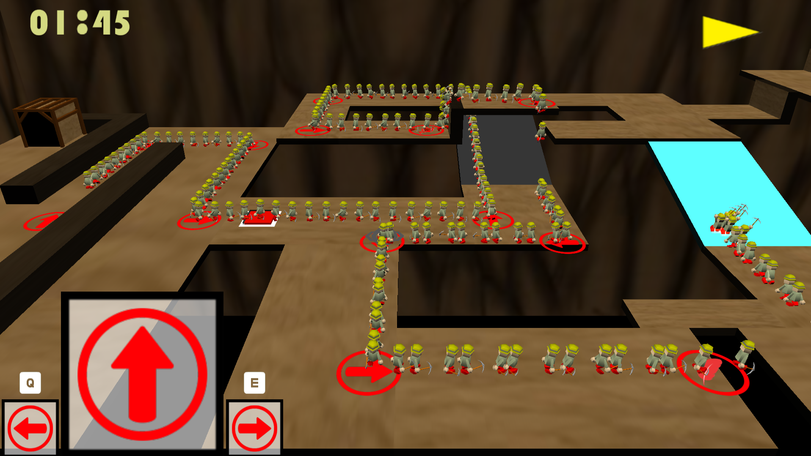
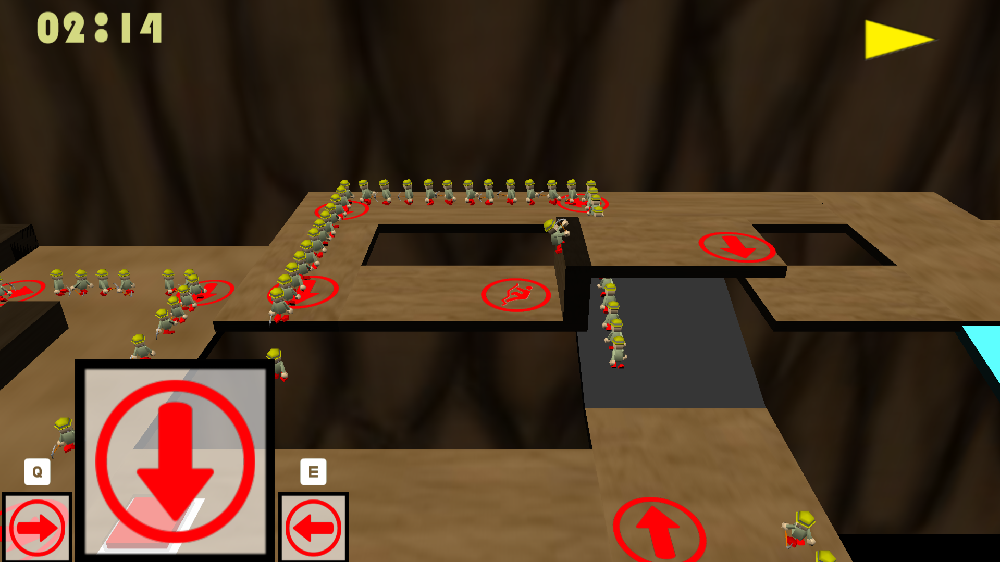
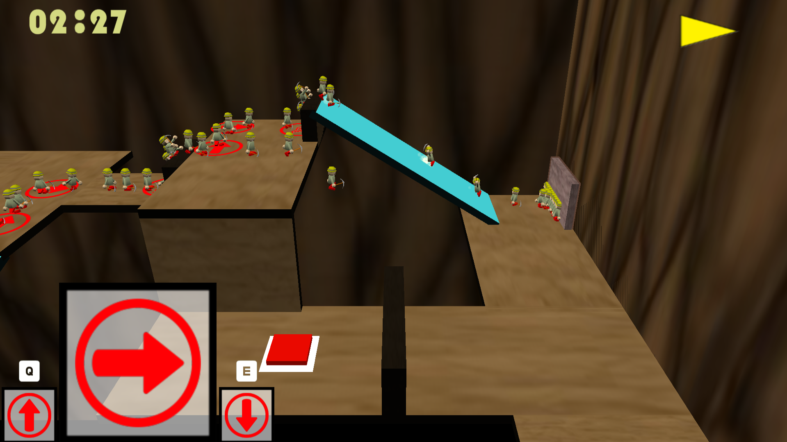
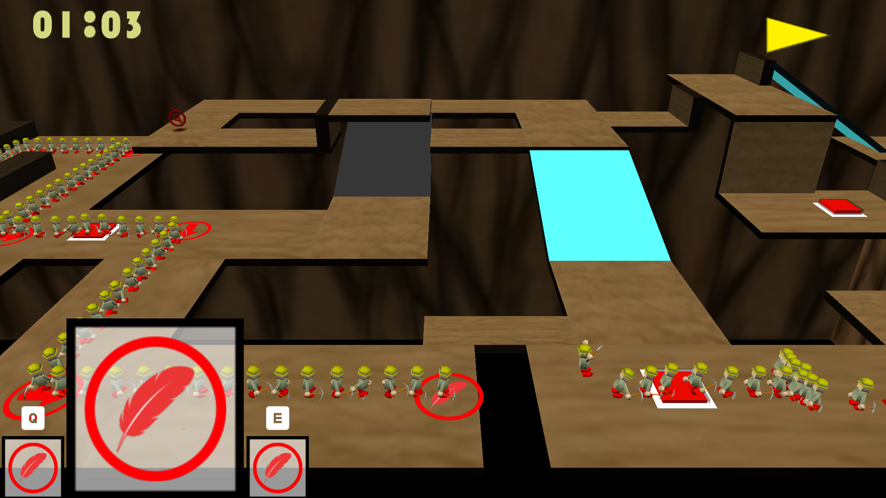
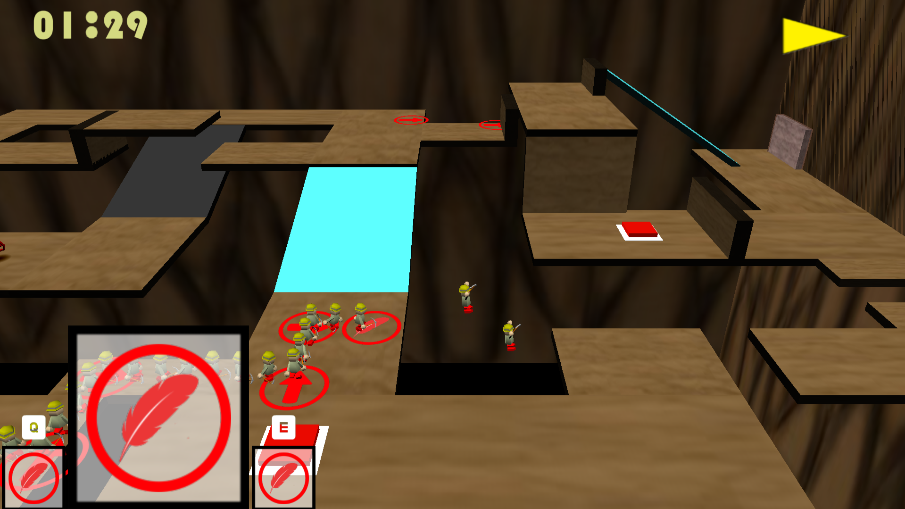
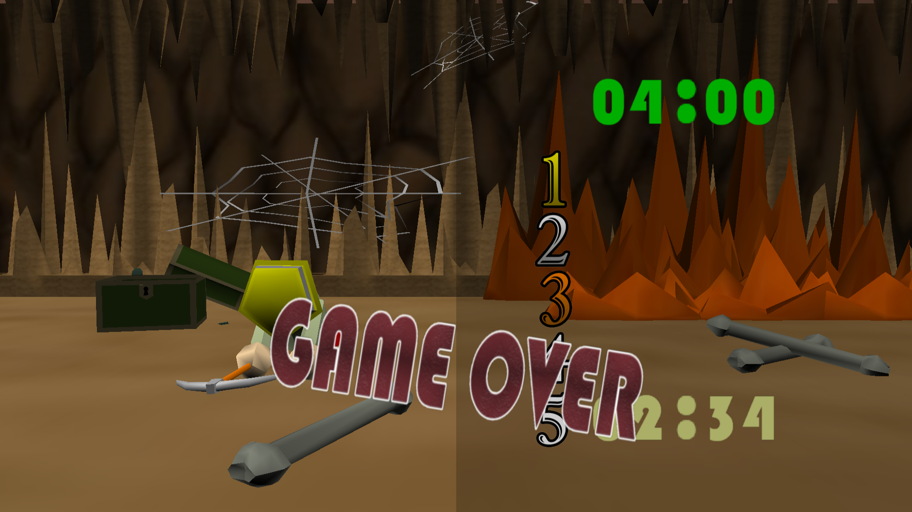
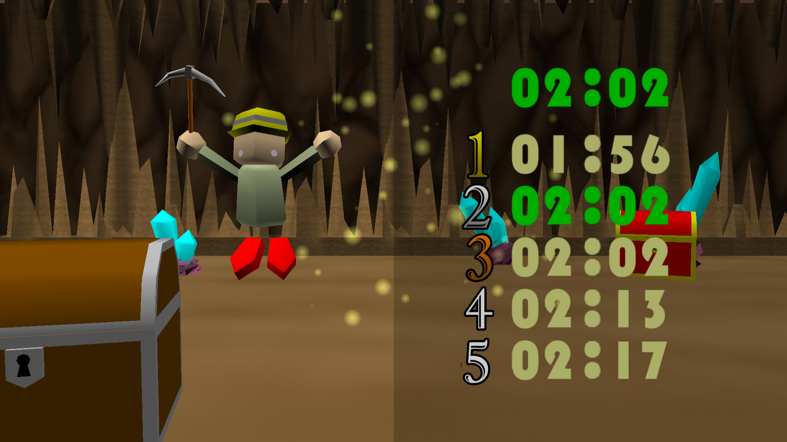

# 作品③
チーム制作のゲーム作品 (WIndows,C++,DirectX9) ※起動可能
2年生の後期にC++で書いたチームでのゲーム作品(テーマがベルトスクロールでした)

## アーカイブ動画URL
[https://youtu.be/lXaOvWuPhWw]

# ゲームプレイ画像

[要件定義書・システム設計書（PDF）はこちら](archive/sheet/HUMAN_SYNC_archive.pdf)
